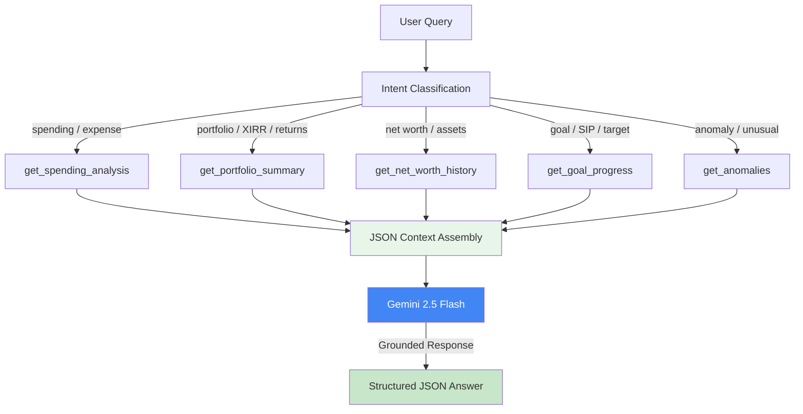
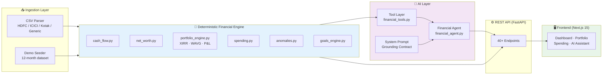

# 💰 WealthOS

<div align="center">

**Privacy-First, AI-Powered Personal Finance Tracker & Portfolio Analysis System**

[](https://python.org/)
[](https://fastapi.tiangolo.com/)
[](https://nextjs.org/)
[](https://sqlite.org/)
[](https://deepmind.google/technologies/gemini/)
[](https://wealth-os-app.vercel.app)

*No data leaves your machine. The AI interprets — Python calculates.*

[Features](#-key-features) • [Architecture](#-system-architecture) • [Tech Stack](#-tech-stack) • [Live Demo](#-live-demo--deployment) • [Installation](#-installation--setup) • [API Reference](#-api-reference)

🌐 **[wealth-os-app.vercel.app](https://wealth-os-app.vercel.app)** — Live frontend (connect your own backend)

</div>

---

## 📖 Overview

**WealthOS** is a privacy-first personal finance system that runs completely locally. It combines a deterministic financial engine with a grounded AI analyst — all your XIRR, CAGR, P&L, savings rate, and net worth calculations are done by verified Python code. The AI (Gemini) only interprets those pre-computed numbers and never makes financial calculations itself.

### 🎯 The Problem it Solves

Traditional finance apps either:
- Send your data to the cloud (privacy risk)
- Use LLMs to calculate finances (hallucination risk — LLMs are bad at math)
- Give you zero transparency into how numbers are computed

### ✨ The Solution

A **Grounded AI** architecture that:
- Runs **100% locally** — no data ever leaves your machine
- Computes all financial metrics in **verified Python** (XIRR, CAGR, WAVG cost basis, P&L)
- Uses **Gemini** only to *interpret* those numbers, not calculate them
- Imports real bank statements (HDFC, ICICI, Kotak, Generic CSV formats)
- Detects duplicate transactions, fraud patterns, and spending anomalies

---

## 🚀 Key Features

### 🧠 Grounded AI Financial Analyst

The AI operates in a strict multi-step pipeline — it never touches raw data or runs math:

<table>
<tr>
<td width="25%" align="center">
<b>🔢 Deterministic Engine</b><br/>
<sub>Python computes XIRR (Newton-Raphson), WAVG cost basis, CAGR, P&L, savings rate with unit-tested precision</sub>
</td>
<td width="25%" align="center">
<b>🛠️ Tool Layer</b><br/>
<sub>10 controlled retrieval functions expose structured JSON to the AI — no raw SQL, no direct DB access</sub>
</td>
<td width="25%" align="center">
<b>🤖 AI Interpretation</b><br/>
<sub>Gemini 2.5 Flash receives JSON context and answers questions grounded strictly in the provided data</sub>
</td>
<td width="25%" align="center">
<b>📊 REST API</b><br/>
<sub>40+ FastAPI endpoints covering accounts, transactions, portfolio, analytics, goals, and AI assistant</sub>
</td>
</tr>
</table>

### 🔗 AI Agent Workflow



### 💹 Financial Engine Capabilities

- **Cash Flow:** Income / Expenses / Savings Rate (transfers & debt payments excluded from expenses)
- **Net Worth:** Assets − Liabilities, emergency fund coverage, liquid savings
- **Portfolio:** XIRR (Newton-Raphson), WAVG cost basis, unrealized/realized P&L, CAGR, sector allocation
- **Spending:** Category breakdowns, MoM trends, merchant normalization
- **Anomaly Detection:** Threshold-based pattern detection for unusual spending
- **Goals:** Progress tracking, SIP projections, required monthly savings

### 📥 Multi-Format CSV Import

Supports real bank statement formats out of the box:
- **HDFC Bank** — savings and credit card statements
- **ICICI Bank** — statement exports
- **Kotak Bank** — savings and credit card statements
- **Generic CSV** — configurable column mapping

Duplicate detection via transaction fingerprinting prevents double-imports.

### 📝 Transaction Management
- **Transactions Page:** View, edit, and delete transactions directly from the UI.
- **Auto-Account Creation:** Automatically provisions a default account on first launch to ensure smooth onboarding for new users.

### 🔒 Privacy First

- **Local-only by default** — SQLite, no cloud sync, no auth required for V1
- No telemetry, no external API calls except Gemini for AI queries
- PostgreSQL-ready for self-hosted multi-user setups

---

## 🏗️ System Architecture



### Service Responsibilities

| Service | Port | Responsibilities |
|---------|------|-----------------|
| **Backend (FastAPI)** | 8000 | Financial engine, AI agent, REST API, CSV ingestion |
| **Frontend (Next.js)** | 3000 | Dashboard, portfolio view, spending analysis, AI chat UI |

---

## 🛠️ Tech Stack

### Backend
| Technology | Version | Purpose |
|------------|---------|---------|
| **Python** | 3.9+ | Core language |
| **FastAPI** | 0.111+ | High-performance async REST API |
| **SQLAlchemy 2** | 2.0+ | Async ORM with SQLite / PostgreSQL |
| **Pydantic v2** | 2.7+ | Request/response validation |
| **SciPy / NumPy** | latest | XIRR (Newton-Raphson), financial math |
| **Pandas** | 2.2+ | CSV parsing and data manipulation |
| **aiosqlite** | 0.20+ | Async SQLite driver |
| **Uvicorn** | 0.29+ | ASGI server |

### AI
| Technology | Purpose |
|------------|---------|
| **Gemini 2.5 Flash** | Grounded LLM interpretation via REST API |
| **google-generativeai** | Python SDK for Gemini |
| **Custom Tool Layer** | 10 controlled data-retrieval functions |

### Frontend
| Technology | Purpose |
|------------|---------|
| **Next.js 15** | React framework with App Router |
| **TypeScript** | Type-safe development |

### Database & Storage
| Technology | Purpose |
|------------|---------|
| **SQLite** | Default local database (zero config) |
| **PostgreSQL** | Production / multi-user option |
| **Alembic** | Database migrations |

---

## 🌐 Live Demo & Deployment

> **Live Frontend:** [wealth-os-app.vercel.app](https://wealth-os-app.vercel.app)

WealthOS frontend is deployed on **Vercel**. Because WealthOS is privacy-first, the deployed site does **not** host any financial data — it connects directly to your own backend running locally on your machine.

### How It Works

```
[Vercel: wealthos.vercel.app] ──── fetch /api/* ────► [Your Machine: localhost:8000]
         (Next.js UI)                                       (FastAPI + SQLite)
```

### Deploy Your Own Frontend to Vercel

1. Fork [aftermoon07/WealthOS](https://github.com/aftermoon07/WealthOS) on GitHub
2. Go to [vercel.com](https://vercel.com) → **New Project** → import your fork
3. Vercel will auto-detect the Next.js app (root directory: `frontend`)
4. Click **Deploy** — done!

### Using the Deployed Frontend

1. Start your local backend:
   ```bash
   cd WealthOS/backend
   uv run uvicorn app.main:app --host 0.0.0.0 --port 8000
   ```
2. Open the deployed URL and go to **`/setup`**
3. Enter your local backend URL (e.g. `http://localhost:8000`)
4. Click **Connect** — the UI saves the URL to `localStorage` and connects privately

> **Note:** For the rewrite proxy to work, the `NEXT_PUBLIC_API_URL` environment variable can be set in Vercel to point to any public backend URL (e.g. a VPS). Leave it unset to use the setup page flow.

---

## 📦 Installation & Setup

### Prerequisites

| Tool | Version | Notes |
|------|---------|-------|
| Python | 3.9+ | Backend & financial engine |
| Node.js | 18+ | Frontend |
| uv | latest | Python package manager (recommended) |
| Gemini API Key | — | Only needed for AI assistant ([get one free](https://aistudio.google.com/)) |

### 1. Clone

```bash
git clone https://github.com/aftermoon07/WealthOS.git
cd WealthOS
```

### 2. Backend Setup (FastAPI, port 8000)

```bash
cd backend

# Using uv (recommended)
uv sync

# OR using pip
pip install -e ".[test]"
```

Create `backend/.env`:

```env
DATABASE_URL=sqlite+aiosqlite:///./finance.db
GEMINI_API_KEY=your_gemini_api_key_here
GEMINI_MODEL=gemini-2.5-flash
MARKET_DATA_SOURCE=DEMO
APP_ENV=development
```

Start the backend:

```bash
uvicorn app.main:app --host 0.0.0.0 --port 8000 --reload
```

Check: [http://localhost:8000/api/health](http://localhost:8000/api/health) returns `{"status": "ok"}`.

Interactive API docs: [http://localhost:8000/docs](http://localhost:8000/docs)

### 3. Seed Demo Data (optional but recommended)

```bash
curl -X POST http://localhost:8000/api/demo/seed
```

This seeds **12 months of realistic financial data** — transactions, investments, goals — so you can explore every feature immediately.

### 4. Frontend Setup (Next.js, port 3000)

```bash
cd frontend
npm install
npm run dev
```

Open [http://localhost:3000](http://localhost:3000).

---

## 📂 Project Structure

```
WealthOS/
├── 📁 backend/
│   ├── app/
│   │   ├── main.py                        # FastAPI entrypoint
│   │   ├── core/config.py                 # Settings (env-based)
│   │   ├── db/database.py                 # Async SQLAlchemy engine
│   │   ├── models/models.py               # ORM models
│   │   ├── schemas/schemas.py             # Pydantic request/response
│   │   ├── api/routes/routes.py           # All REST routes (40+ endpoints)
│   │   └── services/
│   │       ├── domain/
│   │       │   ├── finance/               # cash_flow.py, net_worth.py
│   │       │   ├── portfolio/             # portfolio_engine.py (XIRR, P&L)
│   │       │   ├── analytics/             # spending.py, anomalies.py
│   │       │   ├── transactions/          # categorization.py
│   │       │   └── goals/                 # goals_engine.py
│   │       ├── ai/
│   │       │   ├── tools/financial_tools.py   # 10 controlled tool functions
│   │       │   ├── agent/financial_agent.py   # Agent orchestration
│   │       │   └── prompts/system_prompt.py   # Grounding contract
│   │       └── ingestion/
│   │           ├── csv_parser.py              # HDFC / ICICI / Kotak / Generic CSV
│   │           └── demo_seeder.py             # 12-month demo dataset
│   └── tests/
│       └── test_domain.py                 # 46 domain unit tests
│
└── 📁 frontend/
    ├── app/                               # Next.js App Router pages
    ├── components/                        # UI components
    └── lib/api.ts                         # Typed API client
```

---

## 📊 Data Models

### Transaction Types
| Type | Counted As |
|------|-----------|
| `INCOME` | Income ✅ |
| `EXPENSE` | Expense ✅ |
| `DIVIDEND` | Income ✅ |
| `REFUND` | Reduces Income |
| `TRANSFER` | **Excluded** — prevents double counting |
| `DEBT_PAYMENT` | **Excluded** — credit card repayments |
| `INVESTMENT_BUY` | Investment contribution (not expense) |
| `INVESTMENT_SELL` | Tracked separately |

### Financial Calculation Reference

```
Cash Flow:
  Income = Σ(INCOME) + Σ(DIVIDEND) - Σ(REFUND)
  Expenses = Σ(EXPENSE)  [NOT TRANSFER, DEBT_PAYMENT, INVESTMENT_BUY]
  Savings = Income - Expenses
  Savings Rate = Savings / Income × 100

Net Worth:
  Total Assets = bank balances + portfolio_value + FD/PF
  Total Liabilities = loan_outstanding + cc_outstanding
  Net Worth = Total Assets - Total Liabilities

Portfolio (WAVG Cost Basis):
  Avg Cost = Σ(buy_qty × buy_price) / Σ(buy_qty)
  Unrealized P&L = (Current Price - Avg Cost) × Current Qty
  XIRR = Newton-Raphson on cash flow timeline
  CAGR = (End / Start)^(1/years) - 1
```

---

## 🤖 AI Agent Design

### Grounding Contract

The AI never sees raw database data. It receives a strictly typed JSON payload:

```json
{
  "financial_summary": {
    "income": 85000,
    "expenses": 42000,
    "savings_rate": 50.6
  },
  "portfolio_summary": {
    "xirr": 20.99,
    "unrealized_pnl": 48500,
    "holdings": [...]
  }
}
```

The system prompt explicitly prohibits: hallucinating numbers, calculating returns independently, providing advice not supported by the data.

### Confidence Levels

| Level | Meaning |
|-------|---------|
| `HIGH` | All relevant data available, no missing prices, full history |
| `MEDIUM` | Partial data or missing market prices |
| `LOW` | Missing tool data or model error |

### Available AI Tools

| Tool | Returns |
|------|---------|
| `get_financial_summary` | Income, expenses, savings rate |
| `get_spending_analysis` | Category breakdowns, MoM trends |
| `get_portfolio_summary` | XIRR, realized/unrealized P&L |
| `get_holdings` | Detailed asset positions |
| `get_asset_allocation` | Asset classes and sectors |
| `get_portfolio_risk` | Concentration and volatility metrics |
| `get_goal_progress` | Progress toward financial targets |
| `get_net_worth_history` | Historical net worth tracking |
| `get_anomalies` | Flagged unusual spending patterns |
| `get_monthly_comparison` | Month-over-month comparison |

---

## 🚦 API Reference

### Core Endpoints

| Method | Endpoint | Description |
|--------|----------|-------------|
| GET | `/api/health` | Health check |
| POST | `/api/demo/seed` | Seed 12-month demo dataset |

### Accounts & Transactions

| Method | Endpoint | Description |
|--------|----------|-------------|
| GET | `/api/accounts` | List all accounts |
| POST | `/api/accounts` | Create account |
| GET | `/api/transactions` | List transactions (filterable) |
| PATCH | `/api/transactions/{id}` | Update category / description |

### Analytics

| Method | Endpoint | Description |
|--------|----------|-------------|
| GET | `/api/analytics/cash-flow` | Monthly income, expenses, savings |
| GET | `/api/analytics/net-worth` | Current net worth snapshot |
| GET | `/api/analytics/net-worth/history` | Net worth over time |
| GET | `/api/analytics/spending` | Spending breakdown + trends |
| GET | `/api/analytics/anomalies` | Detected anomalies |

### Portfolio

| Method | Endpoint | Description |
|--------|----------|-------------|
| GET | `/api/portfolio/summary` | XIRR, P&L, portfolio metrics |
| GET | `/api/portfolio/holdings` | Current holdings with prices |
| GET | `/api/portfolio/allocation` | Asset + sector allocation |
| GET | `/api/portfolio/risk` | Risk dimensions |

### Goals & Import

| Method | Endpoint | Description |
|--------|----------|-------------|
| GET | `/api/goals` | All financial goals |
| POST | `/api/goals` | Create goal |
| GET | `/api/goals/analysis` | Goal projections and SIP requirements |
| POST | `/api/import/csv` | Upload bank statement CSV |

### AI & Dashboard

| Method | Endpoint | Description |
|--------|----------|-------------|
| POST | `/api/assistant/query` | Ask the AI financial analyst |
| GET | `/api/dashboard` | Aggregated dashboard data |
| GET | `/api/reports/monthly` | Full monthly report |

---

## 🧪 Testing

```bash
cd backend
pytest tests/ -v
```

**46 unit tests across:**

| Test Suite | Tests | Covers |
|-----------|-------|--------|
| `TestCashFlow` | 10 | Double-counting invariants, savings rate |
| `TestPortfolioEngine` | 13 | XIRR, WAVG, P&L, allocation, concentration |
| `TestCategorization` | 7 | Merchant normalization, rule matching |
| `TestCSVParser` | 6 | Dedup, format detection, invalid rows |
| `TestNetWorth` | 5 | Assets, liabilities, emergency fund |
| `TestAnomalyDetection` | 3 | Threshold-based detection |
| `TestFinancialInvariants` | 2 | System-wide financial invariants |

---

## 🔧 Development Commands

### Backend

```bash
uvicorn app.main:app --reload          # Start with hot reload
pytest tests/ -v                        # Run all tests
pytest tests/ -v -k "TestPortfolio"    # Run specific suite
```

### Frontend

```bash
npm run dev          # Start dev server
npm run build        # Production build
npm run lint         # Run ESLint
```

---

## ⚙️ Configuration

| Variable | Default | Description |
|----------|---------|-------------|
| `DATABASE_URL` | `sqlite+aiosqlite:///./finance.db` | Database connection string |
| `GEMINI_API_KEY` | *(required for AI)* | Gemini API key |
| `GEMINI_MODEL` | `gemini-2.5-flash` | LLM model |
| `MARKET_DATA_SOURCE` | `DEMO` | Price source: `DEMO` / `MANUAL` / `API_FETCH` |
| `APP_ENV` | `development` | Environment |

---

## 🛣️ Roadmap

- [x] Deterministic financial engine (XIRR, WAVG, P&L, CAGR)
- [x] Grounded AI analyst (Gemini + Tool Layer)
- [x] Multi-format CSV import (HDFC, ICICI, Kotak, Generic)
- [x] Duplicate transaction detection
- [x] 46 unit tests
- [x] Demo dataset seeder
- [ ] PostgreSQL support for multi-user
- [ ] Real-time market price fetching
- [ ] Mobile-responsive frontend
- [ ] Export to PDF reports
- [ ] Budget alerts & notifications

---

## 📄 License

This project is licensed under the **MIT License**.

---

## 👨‍💻 Author

**Aditya Suryawanshi**

- GitHub: [@aftermoon07](https://github.com/aftermoon07)
- Project Link: [WealthOS](https://github.com/aftermoon07/WealthOS)

---

<div align="center">

### ⭐ If you found this project helpful, please give it a star!

**Made with ❤️ by Aditya Suryawanshi**

</div>
